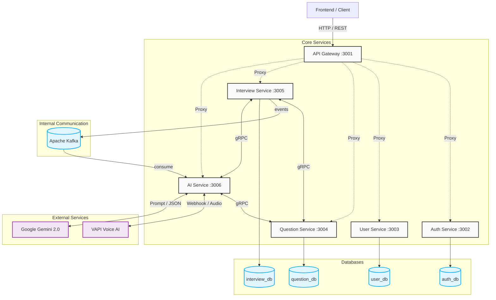

# AI Coach - Mock Interview Platform

🚀 **AI Coach**, yazılımcı adaylarının gerçekçi mülakat senaryolarıyla pratik yapmasını sağlayan, **Yapay Zeka (Google Gemini 2.0)** ve **Sesli AI (VAPI)** destekli yeni nesil bir mülakat hazırlık platformudur.

Sistem, gerçek hayattaki büyük ve karmaşık kurumsal projelerin standartlarına uygun olarak tasarlanmış, dağıtık ve asenkron çalışan bir **Mikroservis (Microservice)** mimarisine sahiptir.

---

## 🏗️ Sistem Mimarisi

Dış dünyadan gelen HTTP trafiğini karşılayan API Gateway ile arkada asenkron/yüksek hızlı çalışan servislerin detaylı şeması:



---

## 🛠️ Servisler ve Görevleri

| Servis Adı       | Port   | Veritabanı     | Görevi                                                                                                                                      |
| :--------------- | :----- | :------------- | :------------------------------------------------------------------------------------------------------------------------------------------ |
| **API Gateway**  | `3001` | -              | Tüm trafiği yönetir. **Rate Limiting** (DDoS koruması), **JWT Checking** ve servis yönlendirmesi (Proxy) yapar.                             |
| **Auth Service** | `3002` | `auth_db`      | Sadece güvenlik ve kimlik doğrulamadan sorumludur. JWT üretir ve doğrular.                                                                  |
| **User Service** | `3003` | `user_db`      | Kullanıcı profillerini, detayları ve abonelik/kredi yönetimini tutar.                                                                       |
| **Question**     | `3004` | `question_db`  | Sistemin soru kütüphanesidir. İstenen teknoloji ve zorluğa göre rastgele soruları hazırlar.                                                 |
| **Interview**    | `3005` | `interview_db` | Mülakat seanslarını (Oturum State'ini) ve cevapları güncel olarak kaydeder.                                                                 |
| **AI Service**   | `3006` | -              | **Sistemin beynidir.** VAPI (Sesli mülakat) webhook'larını karşılar. Eğer spesifik sorular sorulacaksa **Gemini** üzerinden soru ürettirir. |

---

## 🚀 Öne Çıkan Gelişmiş Özellikler

- **VAPI Voice AI:** Kullanıcılar bot ile gerçek insan gibi karşılıklı **sesli olarak** konuşabilir. VAPI, arka planda AI servisimize (Webhook) anlık sinyaller (`save_preferences`, `save_answer`, `end_interview`) göndererek sistemin durumunu (State) günceller.
- **Asenkron Değerlendirme (Apache Kafka):** Kullanıcı mülakatta bir cevap verdiğinde, cevap saniyesinde veritabanına kaydedilir. Puanlama işleminin sistemi bloklamaması için (Kuyruk mimarisi) bu işlem arka planda **Kafka**'ya bırakılır. AI Service, boş vakti olan Kafka kuyruğundan cevapları alarak **Gemini 2.0 Flash** modeline değerlendirtir (Event-Driven Architecture).
- **Yüksek Hızlı İletişim (gRPC):** Servislerin kendi aralarında (Örn. AI Service'in Question Service'e _"Bana 5 tane React sorusu ver"_ demesi) yaptıkları iletişimde standart HTTP yerine **gRPC (Protocol Buffers)** kullanılmıştır. Bu sayede network maliyeti ve gecikme minimuma indirilmiştir.

---

## 🧰 Teknolojiler (Tech Stack)

### Backend (Mikroservis Ağı)

- **Node.js & NestJS Framework** (Tüm servisler için)
- **Apache Kafka** (Asenkron kuyruk yönetimi ve Event-Driven pattern)
- **gRPC** (Servisler arası hızlı iç haberleşme)
- **MongoDB & Mongoose** (İzole, her servise özel veritabanları)

### Frontend

- **Next.js 16** (React Framework)
- **Redux Toolkit** (State Management)
- **SCSS / Tailwind CSS** (Styling)

### Yapay Zeka

- **Google Gemini 2.0 Flash** (LLM - Soru Üretimi ve Mülakat Değerlendirmesi)
- **VAPI** (Voice Agent / Webhook Integration)

### DevOps & Monorepo

- **Docker & Docker Compose** (Container yönetimi)
- **Turborepo & pnpm Workspaces** (Tek depoda (Monorepo) çoklu uygulama gelişimi)

---

## 📦 Kurulum ve Çalıştırma

### Gereksinimler

- Node.js (V20+)
- pnpm (V9+)
- Docker & Docker Compose (Veritabanları ve Kafka için)

### Adımlar

**1. Repoyu klonla ve bağımlılıkları kur:**

```bash
git clone <repo-url>
cd AI-Interview-Simulator
pnpm install
```

**2. Altyapıyı (Kafka, Redis, MongoDB) Docker ile başlat:**

```bash
docker compose up -d mongodb redis kafka zookeeper
```

**3. Gerekli `.env` ortam değişkenlerini kopyala:**
Uygulamalardaki (Örn. `apps/ai-service`) `.env.example` dosyalarını `.env` adıyla oluştur ve **`OPENAI_API_KEY` (veya `GEMINI_API_KEY`)**, **`JWT_SECRET`** gibi tanımları kendi sistemine göre güncelle.

**4. Projeyi çalıştır (Monorepo dev modu):**

```bash
pnpm dev
# veya
./scripts/dev.sh services
```

### 📚 API Dokümantasyonu (Swagger)

Proje ayağa kalktığında **Swagger** arayüzlerinden tüm rotalara erişebilirsiniz:

- **Genel API Gateway (Tüm İstekler İçin):** `http://localhost:3001/docs`
- _Auth Service:_ `http://localhost:3002/docs`
- _User Service:_ `http://localhost:3003/docs`
- _Question Service:_ `http://localhost:3004/docs`
- _Interview Service:_ `http://localhost:3005/docs`
- _AI Service:_ `http://localhost:3006/docs`

---

_Proje, modern mimarilerin gücü ile geliştirilmiş açık kaynaklı (MIT) bir çalışmadır._
