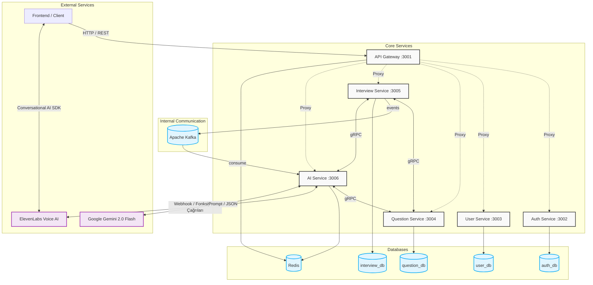

# AI Coach — Mock Interview Platform

**AI Coach**, yazılımcı adaylarının gerçekçi mülakat senaryolarıyla pratik yapmasını sağlayan, **Google Gemini 2.0** ve **ElevenLabs Conversational AI** destekli yeni nesil bir mülakat hazırlık platformudur.

Sistem; gerçek hayattaki büyük ve karmaşık kurumsal projelerin standartlarına uygun olarak tasarlanmış, dağıtık ve asenkron çalışan bir **Mikroservis (Microservice)** mimarisine sahiptir.

---

## Sistem Mimarisi

Dış dünyadan gelen HTTP trafiğini karşılayan API Gateway ile arkada asenkron/yüksek hızlı çalışan servislerin detaylı şeması:


```mermaid
graph TD
    Client[Frontend / Client] -->|HTTP / REST| Gateway[API Gateway :3001]

    subgraph Core Services
        Gateway -.->|Proxy| Auth[Auth Service :3002]
        Gateway -.->|Proxy| User[User Service :3003]
        Gateway -.->|Proxy| Question[Question Service :3004]
        Gateway -.->|Proxy| Interview[Interview Service :3005]
        Gateway -.->|Proxy| AI[AI Service :3006]
    end

    subgraph Internal Communication
        Interview <-->|gRPC| Question
        AI <-->|gRPC| Interview
        AI <-->|gRPC| Question
        Interview -->|events| Kafka[(Apache Kafka)]
        Kafka -->|consume| AI
    end

    subgraph Databases
        Auth --> AuthDB[(auth_db)]
        User --> UserDB[(user_db)]
        Question --> QuestDB[(question_db)]
        Interview --> InterDB[(interview_db)]
        Gateway --> Redis[(Redis)]
        AI --> Redis
    end

    subgraph External Services
        Client <-->|Conversational AI SDK| ElevenLabs[ElevenLabs Voice AI]
        AI <-->|Webhook / Fonksiyon Çağrıları| ElevenLabs
        AI <-->|Prompt / JSON| Gemini[Google Gemini 2.0 Flash]
    end

    classDef service fill:#f9f9f9,stroke:#333,stroke-width:2px;
    classDef db fill:#e1f5fe,stroke:#03a9f4,stroke-width:2px;
    classDef external fill:#f3e5f5,stroke:#9c27b0,stroke-width:2px;

    class Auth,User,Question,Interview,AI,Gateway service;
    class AuthDB,UserDB,QuestDB,InterDB,Kafka,Redis db;
    class ElevenLabs,Gemini external;
```

---

## Servisler ve Görevleri

| Servis            | Port   | Veritabanı     | Görevi                                                                                                                                              |
| :---------------- | :----- | :------------- | :-------------------------------------------------------------------------------------------------------------------------------------------------- |
| **API Gateway**   | `3001` | Redis          | Tüm dış trafiği yönetir. **Rate Limiting** (DDoS koruması), **JWT doğrulama** ve servislere yönlendirme (Proxy) yapar.                             |
| **Auth Service**  | `3002` | `auth_db`      | Yalnızca güvenlik ve kimlik doğrulamadan sorumludur. JWT üretir ve doğrular.                                                                       |
| **User Service**  | `3003` | `user_db`      | Kullanıcı profillerini, detaylarını ve abonelik/kredi yönetimini tutar.                                                                             |
| **Question**      | `3004` | `question_db`  | Sistemin soru kütüphanesidir. İstenen alan, teknoloji ve zorluğa göre soruları hazırlar.                                                            |
| **Interview**     | `3005` | `interview_db` | Mülakat seanslarını (oturum state'ini) ve cevapları anlık olarak kaydeder.                                                                          |
| **AI Service**    | `3006` | Redis (cache)  | **Sistemin beynidir.** ElevenLabs webhook'larını karşılar, Gemini üzerinden soru üretir ve cevap değerlendirmesini koordine eder.                   |

---

## Monorepo Paket Yapısı

Proje, `pnpm workspaces` ve **Turborepo** üzerine kurulmuş bir monorepo'dur. `packages/` altındaki paylaşımlı paketler tüm servislerce ortak kullanılır:

| Paket                    | Açıklama                                                        |
| :----------------------- | :-------------------------------------------------------------- |
| `packages/database`      | Tüm servislerin ortak Mongoose şema ve bağlantı yardımcıları    |
| `packages/grpc`          | Servisler arası gRPC `.proto` tanımları ve istemci fabrikaları   |
| `packages/kafka-client`  | KafkaJS sarmalayıcısı; producer/consumer fabrikaları            |
| `packages/shared-types`  | Servisler ve frontend arasında paylaşılan TypeScript tipleri    |
| `packages/typescript-config` | Merkezi `tsconfig` ön ayarları (base, nextjs, react-library) |
| `packages/eslint-config` | Merkezi ESLint kuralları                                         |

---

## Öne Çıkan Özellikler

### ElevenLabs Conversational AI (Sesli Mülakat)

Kullanıcılar, tarayıcı üzerinden ElevenLabs SDK (`@elevenlabs/react`) aracılığıyla gerçek bir insan gibi AI mülakat koçuyla **sesli olarak** konuşur. ElevenLabs, arka planda AI servisimize özel fonksiyon çağrıları (`save_preferences`, `save_answer`, `end_interview`) göndererek oturumun durumunu (state) gerçek zamanlı günceller.

### Asenkron Değerlendirme — Apache Kafka

Kullanıcı bir mülakat cevabı verdiğinde, cevap anında veritabanına kaydedilir. Puanlama işlemi sistemi bloklamamsın diye **Kafka kuyruğuna** bırakılır. AI Service, kuyruktaki cevapları alarak **Gemini 2.0 Flash** modeline değerlendirir. Bu yaklaşım **Event-Driven Architecture** deseninin birebir uygulamasıdır.

### Yüksek Hızlı İç İletişim — gRPC

Servisler kendi aralarında konuşurken (örneğin AI Service'in Question Service'ten soru istemesi) standart HTTP yerine **gRPC (Protocol Buffers)** kullanır. Bu sayede ağ yükü ve gecikme süresi minimize edilir.

### Redis — Çift Amaçlı Kullanım

- **API Gateway:** `@nestjs/throttler` ile rate limiting; saldırı senaryolarında belirli IP'leri kısa süreliğine bloke eder.
- **AI Service:** Soru havuzu ve mülakat verileri için önbellekleme (cache); tekrarlayan Gemini çağrılarını azaltır.

---

## Teknoloji Yığını (Tech Stack)

### Backend — Mikroservis Ağı

- **Node.js & NestJS v11** — tüm servisler için
- **Apache Kafka** — asenkron kuyruk yönetimi ve Event-Driven pattern
- **gRPC / Protocol Buffers** — servisler arası hızlı iç haberleşme
- **MongoDB & Mongoose** — her servise izole, bağımsız veritabanları
- **Redis** — rate limiting ve uygulama seviyesi cache

### Frontend

- **Next.js 16** — React 19 tabanlı, App Router destekli framework
- **TanStack React Query v5** — sunucu durum yönetimi ve veri senkronizasyonu
- **Tailwind CSS v3 & SCSS** — stil katmanı
- **ElevenLabs React SDK** — sesli mülakat entegrasyonu
- **Zod** — tip güvenli form ve API veri doğrulama

### Yapay Zeka

- **Google Gemini 2.0 Flash** — soru üretimi ve mülakat değerlendirmesi
- **ElevenLabs Conversational AI** — gerçek zamanlı sesli agent; fonksiyon çağrısı desteğiyle mülakat akışını yönetir

### DevOps & Monorepo

- **Docker & Docker Compose** — altyapı servislerinin container yönetimi
- **Turborepo** — monorepo görev orkestrasyonu (build, lint, type-check)
- **pnpm Workspaces** — paket bağımlılıkları ve bağlantılı geliştirme

---

## Kurulum ve Çalıştırma

### Gereksinimler

- **Node.js** v18 veya üzeri
- **pnpm** v9 veya üzeri
- **Docker & Docker Compose** (MongoDB, Redis, Kafka altyapısı için)

### Adımlar

**1. Repoyu klonla ve bağımlılıkları yükle:**

```bash
git clone <repo-url>
cd AI-Interview-Simulator
pnpm install
```

**2. Altyapı servislerini Docker ile başlat:**

```bash
docker compose up -d
```

Bu komut; MongoDB, Redis, Zookeeper ve Kafka container'larını arka planda başlatır.

**3. Ortam değişkenlerini ayarla:**

Her uygulama dizininde `.env.example` dosyası bulunur. Bunları `.env` olarak kopyalayıp kendi değerlerinle doldur:

```bash
# Örnek: AI servisi için
cp apps/ai-service/.env.example apps/ai-service/.env
```

Doldurman gereken başlıca değişkenler:

| Değişken                | Açıklama                                        |
| :---------------------- | :---------------------------------------------- |
| `GEMINI_API_KEY`        | Google AI Studio'dan alınan Gemini API anahtarı |
| `ELEVENLABS_API_KEY`    | ElevenLabs dashboard'dan alınan API anahtarı    |
| `JWT_SECRET`            | JWT token imzalama gizli anahtarı               |
| `MONGODB_URI`           | MongoDB bağlantı adresi                          |
| `REDIS_URL`             | Redis bağlantı adresi                            |

**4. Tüm servisleri geliştirme modunda başlat:**

```bash
pnpm dev
```

Turborepo, tüm mikro servisleri ve frontend'i paralel olarak izleme modunda çalıştırır.

---

## API Dokümantasyonu (Swagger)

Servisler ayağa kalktığında aşağıdaki Swagger arayüzlerinden tüm endpoint'lere erişilebilir:

| Servis            | Swagger URL                        |
| :---------------- | :--------------------------------- |
| **API Gateway**   | `http://localhost:3001/docs`       |
| Auth Service      | `http://localhost:3002/docs`       |
| User Service      | `http://localhost:3003/docs`       |
| Question Service  | `http://localhost:3004/docs`       |
| Interview Service | `http://localhost:3005/docs`       |
| AI Service        | `http://localhost:3006/docs`       |

> Genel kullanım için **API Gateway** üzerinden isteklerin gönderilmesi önerilir. Gateway, JWT doğrulaması ve rate limiting'i otomatik uygular.

---

## Lisans

Bu proje MIT lisansı altında yayımlanmıştır. Açık kaynak katkılarına açıktır.
